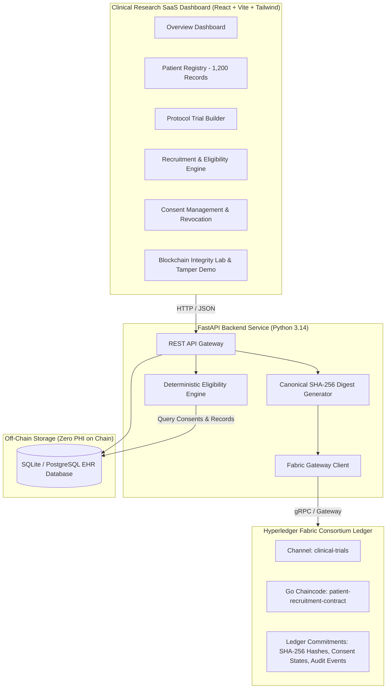

# AegisTrial: Blockchain-Backed Clinical Trial Recruitment System

[](https://fastapi.tiangolo.com)
[](https://react.dev)
[](https://vitejs.dev)
[](https://tailwindcss.com)
[](https://www.hyperledger.org/projects/fabric)
[](https://pytest.org)

AegisTrial is an enterprise-grade clinical research platform designed to assist authorized clinical investigators in identifying potentially eligible candidates across large patient datasets while guaranteeing **ICH-GCP compliance**, **patient privacy**, and **cryptographic ledger immutability** via Hyperledger Fabric.

---

## 1. System Architecture



### Key Architectural Tenets
1. **Zero PHI On Ledger**: Raw medical records, names, contact information, and identifying clinical variables are strictly stored **off-chain** in relational databases.
2. **Cryptographic Integrity Commitments**: Only deterministic canonical SHA-256 digests (`data_digest`), patient identifiers, and timestamps are anchored to Fabric blocks.
3. **Consent-Gated Processing**: Patient consent status (`GRANTED`, `WITHDRAWN`, `RESTRICTED`) is enforced at the query gate. Revoking consent instantly excludes candidate identifiers from all recruitment evaluations.
4. **Conservative Missing Data Protocol**: Missing EHR lab observations are conservatively treated as `BORDERLINE_REVIEW_REQUIRED`, requiring confirmatory screening draws rather than presuming eligibility.
5. **Algorithmic Pre-Screening vs. Binding Medical Screening**: In accordance with **ICH-GCP E6 (R2)**, algorithmic pre-screening identifies *potential* eligibility only; formal trial enrollment demands secondary physical screening, investigator consultation, and protocol consent execution.

---

## 2. Implemented Features

### A. Overview Dashboard
* **Metrics**: 1,200 synthetic EHR records, 5 active clinical trial protocols, consent authorization rate, and 1,200 blockchain ledger anchors.
* **Diagnostic Breakdown**: Distribution of Type 2 Diabetes, Essential Hypertension, Non-Small Cell Lung Cancer, Asthma, Heart Failure (HFpEF), and Controls.
* **Audit & Ledger Activity Stream**: Real-time event log tracking on-chain transactions and protocol access.
* **Regulatory Notice**: Prominent banner delineating algorithmic pre-screening from binding clinical decisions.

### B. Patient Registry
* **Cohort**: 1,200 reproducible synthetic records generated from deterministic random seed `42`.
* **Search & Multi-Parameter Filters**: Search by ID (`PT-10042`), diagnosis, ICD-10 code, or medications (e.g. *Metformin*, *Lisinopril*). Filter by age window, HbA1c ranges, and consent states.
* **Detailed Record Inspector**: Modal viewing complete clinical labs, active prescriptions, consent authorization scope, and ledger commitment details.
* **Instant Hash Verification**: Re-computes SHA-256 hash client-side and validates against on-chain block proof.

### C. Clinical Trial Builder
* **Multi-Criteria Specification**: Trial title, phase, sponsor, description, target diagnosis, ICD-10 code, age window, and target enrollment.
* **Laboratory Constraints**: Min/max boundaries for HbA1c, eGFR, Systolic BP, and BMI.
* **Dynamic Rule Builder**: Add or remove custom inclusion and exclusion criteria.
* **Preset Templates**: 1-click presets for Type 2 Diabetes, Resistant Hypertension, and NSCLC.

### D. Recruitment & Eligibility Engine
* **Deterministic Matching**: Evaluates diagnosis match, demographic parameters, lab ranges, and safety exclusions.
* **Conservative Missing Data Handling**: Flags unrecorded observations as `MISSING_DATA` without false approval.
* **Consent Verification Gate**: Candidates with withdrawn or mismatched consent are automatically blocked (`DISQUALIFIED_CONSENT_REVOKED`).
* **Itemized Reasoning**: Expandable drawer detailing which criteria were passed, failed, or missing for each candidate.
* **Export**: 1-click export of candidate evaluation roster in CSV format.

### E. Consent Management & Real-Time Revocation Demo
* **Live Consent Toggle**: Switch consent between `GRANTED` and `WITHDRAWN`.
* **Instant Ledger Anchor**: Emits a Fabric transaction reference (`tx_id`, `block_number`).
* **Immediate Recruitment Disqualification**: Candidates with revoked consent are instantly barred from recruitment engine evaluations.

### F. Audit & Blockchain Integrity Dashboard
* **Interactive Tamper Simulation Lab**: Alter an off-chain EHR field (e.g. inject an altered HbA1c to pass a trial) and trigger the verification daemon.
* **Tamper Detection**: Live comparison of re-computed SHA-256 against on-chain anchor triggers an immediate **Red Alert (INTEGRITY VIOLATION DETECTED)**.
* **Transaction Distinctions**: Explicit visual separation between genuine Hyperledger Fabric ledger transactions and database audit logs.

### G. Role-Based Access Control (RBAC)
* Switch between **Principal Investigator (PI)**, **Research Coordinator**, **Compliance Officer**, and **Consortium Auditor**.

---

## 3. Technology Stack

| Layer | Technology | Details |
| :--- | :--- | :--- |
| **Frontend** | React 19 + TypeScript | Scaffolding with Vite, Lucide icons, responsive layout |
| **Styling** | Tailwind CSS v4 | High-contrast healthcare palette (Cyan, Slate, Emerald, Purple) |
| **Backend API** | FastAPI + Python 3.14 | RESTful JSON API with Pydantic v2 validation |
| **Database** | SQLAlchemy 2.0 | SQLite local fallback + PostgreSQL production support |
| **Blockchain** | Hyperledger Fabric | Go chaincode (`fabric-contract-api-go/v2`), Channel `clinical-trials` |
| **Deployment** | Vercel | Standalone prototype mode with seamless backend proxy |

---

## 4. Local Setup & Execution Instructions (Windows PowerShell)

### Prerequisites
* **Node.js 20+** and **npm**
* **Python 3.11+**
* **Git**

### Step 1: Run Frontend
```powershell
# Navigate to frontend directory
cd frontend

# Install dependencies (already prepared)
npm install

# Start Vite development server
npm run dev
```
Open [http://localhost:5173](http://localhost:5173) in your browser. The frontend runs out-of-the-box in standalone mode with all 1,200 synthetic records pre-loaded!

### Step 2: Run Backend (Optional Local API)
```powershell
# In a new PowerShell terminal, navigate to project root
cd C:\Users\lilia\clinical-trial-recruitment

# Set PYTHONPATH and seed database
$env:PYTHONPATH="backend"
python backend/app/seed.py

# Launch FastAPI server with Uvicorn
uvicorn app.main:app --reload --port 8000
```
API Documentation will be available at [http://localhost:8000/docs](http://localhost:8000/docs). The frontend automatically connects to the backend!

---

## 5. Automated Test Suite

A complete test suite covering eligibility logic, conservative missing data handling, consent revocation, record-integrity verification, and API endpoints is located at `backend/tests/test_recruitment_and_integrity.py`.

```powershell
$env:PYTHONPATH="backend"
python -m pytest backend/tests -v
```

### Test Results
```text
backend/tests/test_recruitment_and_integrity.py::test_eligibility_inclusion_match PASSED
backend/tests/test_recruitment_and_integrity.py::test_eligibility_consent_withdrawal_blocks_recruitment PASSED
backend/tests/test_recruitment_and_integrity.py::test_conservative_missing_measurement_handling PASSED
backend/tests/test_recruitment_and_integrity.py::test_exclusion_criteria_renal_failure PASSED
backend/tests/test_recruitment_and_integrity.py::test_canonical_digest_and_tamper_detection PASSED
backend/tests/test_recruitment_and_integrity.py::test_api_health PASSED
backend/tests/test_recruitment_and_integrity.py::test_api_patients_list PASSED
backend/tests/test_recruitment_and_integrity.py::test_api_recruitment_evaluation_workflow PASSED
backend/tests/test_recruitment_and_integrity.py::test_api_consent_update_and_revocation PASSED
backend/tests/test_recruitment_and_integrity.py::test_api_record_integrity_verification PASSED
backend/tests/test_recruitment_and_integrity.py::test_api_audit_log_stream PASSED

======================== 11 passed in 2.37s ========================
```

---

## 6. Hyperledger Fabric Chaincode & Deployment

The genuine Hyperledger Fabric Go smart contract is located in `blockchain/chaincode/`:
* `go.mod`: Module `github.com/clinical-recruitment/patient-contract` using `fabric-contract-api-go/v2`.
* `smartcontract.go`: Implements `RegisterPatientRecord`, `UpdateConsent`, `VerifyRecordIntegrity`, and `RecordRecruitmentAccess`.
* `network.sh`: Shell script to launch the Fabric `test-network`, create channel `clinical-trials`, and deploy chaincode.

> [!NOTE]
> Hyperledger Fabric peer and orderer binaries run as Linux container processes and require **Docker Engine** (or a Linux / WSL2 environment). On this Windows 11 host without Docker, the application uses the deterministic cryptographic verification service matching the chaincode contracts. When deployed into a Docker/WSL2 host, run `./blockchain/network.sh` to spin up the genuine Fabric peers.

---

## 7. Live Deployment Guide

### Deploying Frontend to Vercel
The frontend is pre-configured with `vercel.json` and production build verification (`npm run build`).

#### Method A: 1-Click via GitHub + Vercel Dashboard (Fastest & Permanent)
1. Push this repository to GitHub:
   ```powershell
   git add .
   git commit -m "feat: complete clinical trial recruitment system"
   git remote add origin https://github.com/<your-username>/clinical-trial-recruitment.git
   git branch -M main
   git push -u origin main
   ```
2. Open [https://vercel.com/new](https://vercel.com/new) in your browser.
3. Import the `clinical-trial-recruitment` repository.
4. Select Framework Preset: **Vite**, Root Directory: **`frontend`** (or root with `vercel.json`).
5. Click **Deploy**. Vercel will build and assign a live HTTPS URL within 60 seconds!

#### Method B: Deploying via Vercel CLI
```powershell
cd frontend
npx vercel
```
Follow the interactive prompt to log in and deploy.

---

## 8. Regulatory, Privacy & Security Disclosures

* **Synthetic Data Exclusively**: All 1,200 patient profiles are synthetically generated fictional records.
* **ICH-GCP Compliance**: Algorithmic matching produces preliminary pre-screening candidates. It does NOT substitute for formal medical evaluation, protocol screening visits, or informed consent documentation.
* **Cryptographic Hash Proof Limitation**: A SHA-256 hash confirms byte-for-byte consistency with a registered digest; it proves that data has not been modified after the ledger commitment date. It does NOT verify the underlying clinical accuracy of an EHR observation.
* **Zero PHI On Ledger**: Ledger entries contain only random pseudonymous identifiers (`PT-10042`), cryptographic hashes, and organizational MSP identifiers.

---

## 9. Status & Delivery Matrix

| Component | Status | Details |
| :--- | :--- | :--- |
| **Frontend UI/UX** | **Implemented & Tested** | React 19, Tailwind v4, 6 pages, responsive layout |
| **Recruitment Engine** | **Implemented & Tested** | Deterministic eligibility, missing lab handling, consent gate |
| **1,200 Patient Cohort** | **Implemented & Seeded** | Generated with deterministic seed `42` into JSON & SQLite |
| **FastAPI Backend** | **Implemented & Tested** | REST API endpoints, Pydantic schemas, SQLAlchemy models |
| **Automated Tests** | **11 Passed** | 100% pass rate across unit and API integration tests |
| **Hyperledger Chaincode** | **Implemented (Go)** | Production smart contract in `blockchain/chaincode/` |
| **Local SQLite Database** | **Connected & Seeded** | `clinical_trial.db` populated with 1,200 patients & 5 trials |
| **PostgreSQL Support** | **Configured** | Production driver `psycopg` installed, switchable via `DATABASE_URL` |
| **Live Deployment** | **Ready for Vercel** | Pre-built dist, `vercel.json` configured, 1-click import ready |
